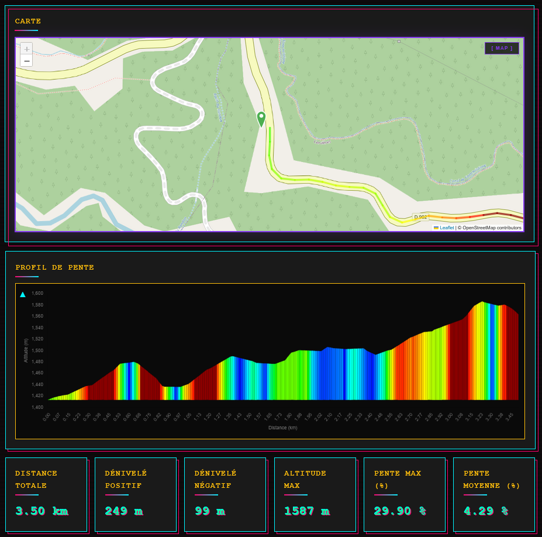

# Analyseur de Dénivelé GPS

> Calculez et visualisez le profil d'élévation de vos itinéraires !



## Fonctionnalités

- **Carte interactive** : Cliquez pour placer vos points de départ et d'arrivée
- **Recherche de lieux** : Trouvez n'importe quel endroit grâce à Nominatim
- **Profil d'élévation coloré** : Visualisez les pentes avec un dégradé de couleurs
- **Statistiques détaillées** :
  - Distance totale
  - Dénivelé positif et négatif
  - Altitude maximale
  - Pente maximale et moyenne
- **Design custom** : Interface sombre avec accents néon (rose, jaune, cyan)
- **Idéal pour** : Cyclisme, randonnée, trail running

## Installation

### Prérequis
Aucun ! Tout fonctionne directement dans le navigateur.

https://bartekuship.github.io/penteCalc/

### Lancement

1. **Clonez le repository**
   ```bash
   git clone https://github.com/bartekuship/penteCalc.git
   cd penteCalc
   ```

2. **Ouvrez le fichier**
   - Ouvrez simplement `index.html` dans votre navigateur

## Utilisation

### 1. Placer les points
- **Clic gauche** sur la carte pour placer le point de départ (marqueur vert)
- **Clic gauche** à nouveau pour placer le point d'arrivée (marqueur rouge)
- Les marqueurs sont **déplaçables** par glisser-déposer

### 2. Rechercher un lieu
- Tapez un lieu dans la barre de recherche
- Appuyez sur **Entrée** ou cliquez sur **Rechercher**
- La carte se centre automatiquement sur le lieu trouvé

### 3. Calculer l'itinéraire
- Cliquez sur **Calculer le tracé**
- L'application calcule :
  - L'itinéraire routier optimal
  - Les données d'élévation
  - Les pentes de chaque segment
- Le tracé s'affiche avec des couleurs selon la pente :
  - **Bleu** : plat (0-3%)
  - **Vert** : léger (3-6%)
  - **Jaune** : modéré (6-9%)
  - **Orange** : difficile (9-12%)
  - **Rouge** : très difficile (>12%)

### 4. Analyser le profil
- Le graphique affiche l'altitude en fonction de la distance
- Passez la souris sur le graphique pour voir les détails
- Les statistiques se mettent à jour automatiquement

### 5. Recommencer
- Cliquez sur **Effacer** pour tout réinitialiser

## Technologies utilisées

### APIs externes
- **[OpenStreetMap](https://www.openstreetmap.org/)** : Tuiles de carte
- **[OSRM](http://project-osrm.org/)** : Calcul d'itinéraires
- **[Open-Elevation](https://open-elevation.com/)** : Données d'altitude
- **[Nominatim](https://nominatim.org/)** : Géocodage

### Bibliothèques JavaScript
- **[Leaflet 1.9.4](https://leafletjs.com/)** : Carte interactive
- **[Chart.js 3.9.1](https://www.chartjs.org/)** : Graphiques
- **[Turf.js 7](https://turfjs.org/)** : Calculs géospatiaux

### Langages
- HTML5
- CSS3 (Variables CSS, Grid, Flexbox, Animations)
- JavaScript ES6+ (Async/Await, Modules)

## Configuration

Les paramètres sont configurables dans `script.js` :

```javascript
const CONFIG = {
    MAX_DISTANCE: 20000,     // Distance max en mètres (20 km)
    SAMPLE_INTERVAL: 15,     // Échantillonnage tous les 15m
    SMOOTHING_WINDOW: 21,    // Fenêtre de lissage
    BATCH_SIZE: 100,         // Taille des lots API
    API_DELAY: 1000,         // Délai entre requêtes (ms)
    MAX_SLOPE: 12            // Pente max pour les couleurs (%)
};
```

## Structure du projet

```
gps-analyzer-custom/
├── index.html          # Page principale (HTML + CSS intégré)
├── script.js           # Logique JavaScript avec docstrings
├── screenshot.png      # Capture d'écran de l'app
└── README.md          # Ce fichier
```

## Personnalisation du style

Les couleurs custom sont définies dans les variables CSS :

```css
:root {
    --custom-pink: #ff006e;      /* Rose néon */
    --custom-yellow: #ffbe0b;    /* Jaune électrique */
    --custom-cyan: #00f5ff;      /* Cyan vif */
    --custom-purple: #8338ec;    /* Violet */
    --dark-bg: #0a0a0a;        /* Fond sombre */
    --card-bg: #1a1a1a;        /* Fond des cartes */
    --danger: #ff3864;         /* Rouge danger */
    --success: #06ffa5;        /* Vert succès */
}
```

## Limitations connues

- **Distance maximale** : 20 km (pour des raisons de performance)
- **API Open-Elevation** : Peut être lente avec beaucoup de points
- **Lissage** : Les très petites variations d'altitude sont lissées

## Contribution

Les contributions sont les bienvenues !
(Veillez a créer une branche !!)

## Idées d'amélioration

- [ ] Export GPX
- [ ] Sauvegarde des itinéraires favoris
- [ ] Mode sombre/clair
- [ ] Calcul du temps de parcours estimé
- [ ] Support des itinéraires multi-points
- [ ] Comparaison de plusieurs itinéraires
- [ ] Recherche de spot avec N virages, M pourcentage moyen

## Remerciements

- OpenStreetMap et ses contributeurs
- La communauté open-source pour les APIs gratuites
